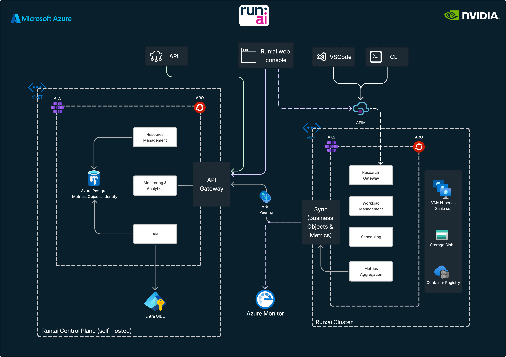
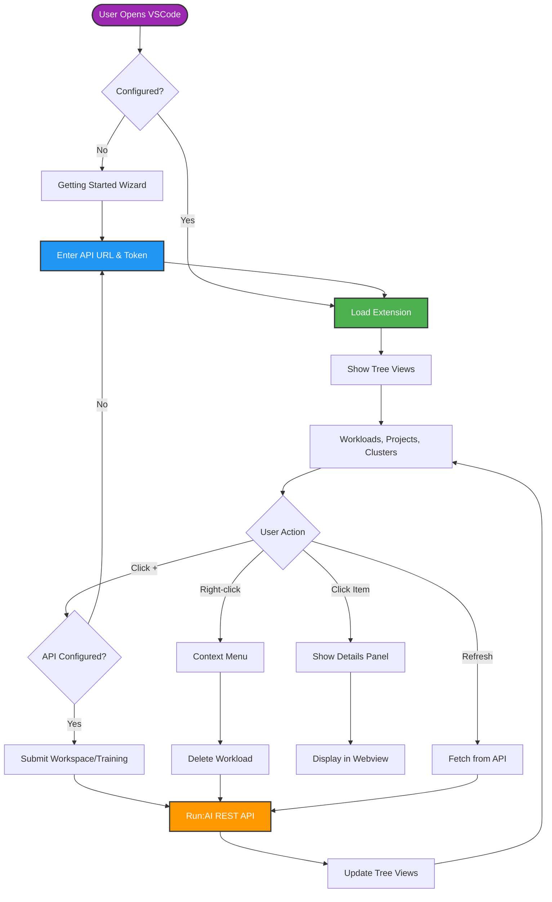
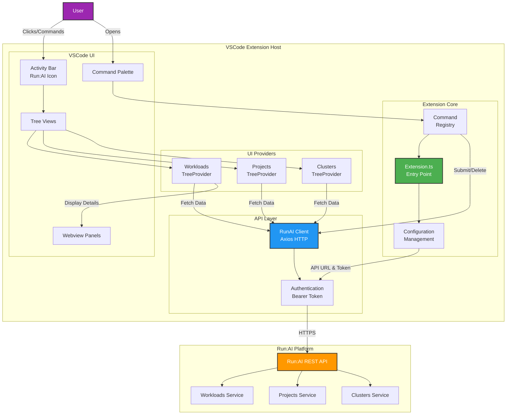
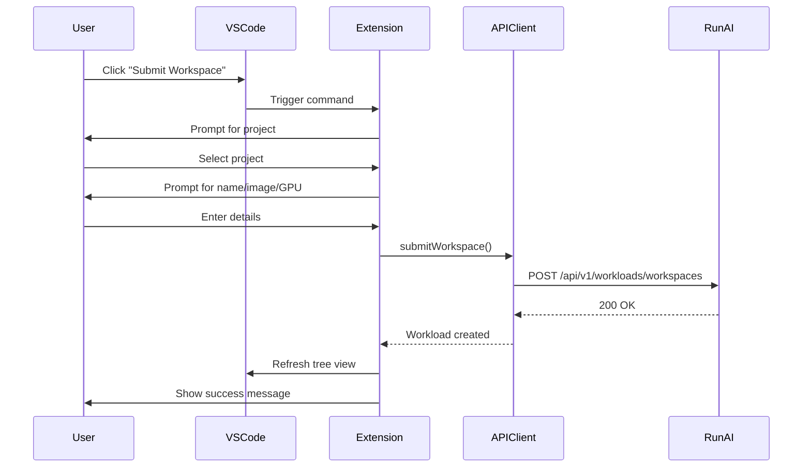
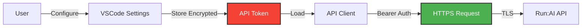

# Run:AI VSCode Extension

Manage Run:AI workloads, projects, and clusters directly from VSCode. Built for AI Engineers, Platform Engineers, and ML Researchers.

  

> [!NOTE]
> This extension is currently a work in progress. The Run:AI Azure Marketplace offer will launch soon!

## 🚀 Features

- ✅ **View & Manage Workloads** - Browse, submit, and delete workspaces and training jobs
- 🎯 **Project Browser** - View all projects and departments
- 🖥️ **Cluster Monitor** - Track connected clusters
- 📊 **Real-time Status** - Color-coded workload indicators (🟢 Running, 🟡 Pending, 🔴 Failed, ✅ Completed)
- 🔄 **Quick Refresh** - One-click updates for all views
- 📝 **Detailed Views** - Comprehensive workload information with resource allocation
- 🚀 **GPU Support** - Specify GPU requirements for workloads



## 📦 Installation

**From Source:**
```bash
git clone https://github.com/Azure/nvidia-runai-vscode-extension.git
cd runai-vscode-extension
npm install
npm run compile
code .  # Open in VSCode, then press F5 to test
```

**From VSIX:** Extensions view (Ctrl+Shift+X) → "..." menu → "Install from VSIX..."

## ⚙️ Configuration

**Quick Setup:**
1. Ctrl+Shift+P → `Run:AI: Configure API Settings`
2. Enter API URL: `https://app.run.ai`
3. Enter API Token

**Or via Settings:**
```json
{
  "runai.apiUrl": "https://app.run.ai",
  "runai.token": "your-api-token-here"
}
```

## 📖 Usage

**Quick Start:**
1. Click Run:AI icon in Activity Bar
2. See three views: **Workloads**, **Projects**, **Clusters**
3. Click ➕ to submit a workspace or training job

**Submit Workspace:**
- Click ➕ in Workloads view
- Or Ctrl+Shift+P → `Run:AI: Submit Workspace`
- Select project, enter name, image, GPU count

**View Details:** Click any workload to see status, resources, and metadata

**Delete:** Right-click workload → "Delete Workload"

**Refresh:** Click 🔄 in any view toolbar

## 🎯 Commands

Access all commands via Command Palette (Ctrl+Shift+P):

| Command | Description |
|---------|-------------|
| `Run:AI: Configure API Settings` | Set up API URL and authentication token |
| `Run:AI: Submit Workspace` | Create a new interactive workspace |
| `Run:AI: Submit Training Job` | Launch a new training workload |
| `Run:AI: Delete Workload` | Remove a workload (requires confirmation) |
| `Run:AI: List All Workloads` | View all workloads in a quick pick menu |
| `Run:AI: Refresh Workloads` | Reload the workloads view |
| `Run:AI: Refresh Projects` | Reload the projects view |
| `Run:AI: Refresh Clusters` | Reload the clusters view |

## 🏗️ Architecture

### User Flow



### Component Architecture



### Workspace Submission Flow



### Security & Authentication



## 🔧 Development

**Prerequisites:** Node.js 16+, npm 8+, VSCode 1.104+

**Setup:**
```bash
git clone https://github.com/Azure/nvidia-runai-vscode-extension.git
cd runai-vscode-extension
npm install
npm run compile    # or `npm run watch` for auto-compile
```

**Test:** Press F5 in VSCode to launch Extension Development Host

**Package:** 
```bash
npm install -g @vscode/vsce
vsce package
```

## 📚 API Integration

**Endpoints Used:**
- `GET /api/v1/workloads` - List workloads
- `POST /api/v1/workloads/workspaces` - Submit workspace
- `POST /api/v1/workloads/trainings` - Submit training
- `DELETE /api/v1/workloads/{id}` - Delete workload
- `GET /api/v1/projects` - List projects
- `GET /api/v1/clusters` - List clusters

**Docs:** [Run:AI API Documentation](https://api-docs.run.ai/latest/)

## 🤝 Contributing

1. Fork the repo
2. Create feature branch: `git checkout -b feature/amazing-feature`
3. Commit changes: `git commit -m 'Add amazing feature'`
4. Push: `git push origin feature/amazing-feature`
5. Open Pull Request

**Code Style:** TypeScript best practices, ESLint (`npm run lint`)

## 🐛 Troubleshooting

**Extension not visible:** Reload VSCode (Ctrl+Shift+P → "Developer: Reload Window")

**"Run:AI client not initialized":** Run `Run:AI: Configure API Settings` and enter API URL + token

**Workloads not loading:** Click refresh (🔄) or check network connectivity to Run:AI API

**API connection issues:** Verify `runai.apiUrl` in settings and check firewall/proxy settings

## 📄 License

MIT License - see [LICENSE](LICENSE)

## 📞 Support

- [GitHub Issues](https://github.com/Azure/nvidia-runai-vscode-extension/issues)
- [Run:AI Documentation](https://docs.run.ai/)
- Run:AI support for API issues

## 🗺️ Roadmap

- [ ] Real-time status updates & polling
- [ ] Workload logs viewer
- [ ] Port forwarding for workspaces
- [ ] GPU utilization metrics
- [ ] Workload templates
- [ ] Multi-cluster switching
- [ ] SSH & Jupyter integration
- [ ] TensorBoard integration

## 📸 Screenshots

### Extension Views


The Run:AI icon appears in the Activity Bar, providing three main views:

**Workloads View:**
```
Run:AI
  └─ Workloads
      ├─ 🟢 my-training-job (Running - team-ml)
      ├─ 🟡 data-processing (Pending - team-data)
      └─ ✅ model-evaluation (Completed - team-ml)
```

**Projects View:**
```
  └─ Projects  
      ├─ 📁 team-ml (ML Department)
      ├─ 📁 team-data (Data Science)
      └─ 📁 team-research (Research)
```

**Clusters View:**
```
  └─ Clusters
      ├─ 🖥️  production-cluster (https://prod.run.ai)
      └─ 🖥️  staging-cluster (https://staging.run.ai)
```

### Workload Details Panel
When clicking a workload, a detailed webview displays:

```
┌──────────────────────────────────────┐
│ my-training-job                      │
│                                      │
│ Status:    🟢 Running                │
│ Type:      Training                  │
│ Project:   team-ml                   │
│ Created:   2025-10-06 10:30:00      │
│                                      │
│ Resources                            │
│ GPU:       2                         │
│ CPU:       4 cores                   │
│ GPU Memory: 16Gi                     │
│ CPU Memory: 32Gi                     │
└──────────────────────────────────────┘
```

---

**Made with ❤️ for AI Engineers, Platform Engineers, and ML Researchers**
